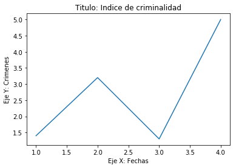
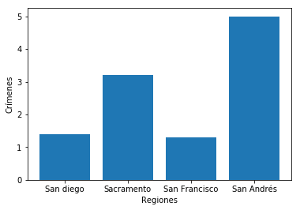
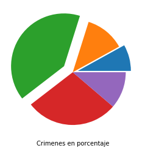

[`Análisis de Datos con Python`](../../README.md) > [`Sesión 2`](../README.md) > `Ejemplo 2`

## Ejemplo 2: *Panda Dataframes*

### 1. Objetivos :dart:

- Generar gráficos usando __Matplotlib__

### 2. Requisitos :clipboard:

1. Ambiente de conda para el curso levantado
1. Servidor de __Jupyter__ levantado
1. Archivo __CSV__ con el reporte de crímenes

### 3. Desarrollo :rocket:

A continuación se muestra el siguiente cuaderno de __Jupyter__ descargalo y agrégalo a tu servidor, analiza el contenido. Para analizarlo debes mover el archivo a la carpeta donde levantaste el servidor correspondiente.

---

<details><summary><a href="codigos/ejemplo3.ipynb">ejemplo3.ipynb</a></summary>

# Pandas Dataframes & MatPlotLib
### Dr. Antonio Arista Jalife

Pandas utiliza una estructura llamada "DataFrame" para manejar sus datos, de tal manera que es importante que nos familiaricemos con la estructura de ellos. 

#### Importamos Pandas a nuestro notebook:


```python
import pandas as pd
```

#### Cargamos el Dataset y lo desplegamos:


```python
dataframe = pd.read_csv('CrimeReports.csv')

dataframe
```

Si nosotros queremos las primeras 10 líneas podemos utilizar el comando .head(10), o el comando .tail(10) si queremos las últimas 10.


```python
dataframe.head(10)
```


```python
dataframe.tail(10)
```

No todas las columnas en un dataframe son útiles, por lo que nosotros podemos elegir las columnas y el orden de la siguiente manera:
dataframe[['nombre columna 1', 'nombre columna 2',...]]


```python
dataframe[['address','latitude','longitude', 'ucr_ncic_code']]
```

Ahora, donde viene lo interesante: Seleccionar las filas dependiendo de lo que requerimos. 
los códigos NCIC de este dataset (ucr_ncic_code) son los códigos de crimenes cometidos en estados unidos. Si somos un data scientist de la policia, necesitamos la descricpión del crimen (crimedescr) y el código.


```python
dataframe[['ucr_ncic_code', 'crimedescr']]
```

Parece ser que los incidentes con arma de fuego son el código 7000, por lo que necesitamos solamente las filas con el código 7000


```python
#De toda la base de datos, seleccionamos solo dos columnas:
AllCodes = dataframe[['ucr_ncic_code', 'crimedescr']]
#Y de esas dos columnas, seleccionamos solo aquellas que tengan el código 7000 en ucr:
Code7000 = AllCodes[AllCodes['ucr_ncic_code'] == 7000]
#Y mostramos...
Code7000
```

Que pasa si necesitamos también los crimenes cuya descripción tiene 'weapon' en su string? Con esto podemos hacer una condicional doble: recuerda que & significa 'and', y | significa 'or'


```python
#De toda la base de datos, seleccionamos solo dos columnas:
AllCodes = dataframe[['ucr_ncic_code', 'crimedescr']]
#Y de esas dos columnas, seleccionamos solo aquellas que tengan el código 7000 y que contengan la palabra 'WEAPON':
Code7000 = AllCodes[(AllCodes['ucr_ncic_code'] == 7000) & (AllCodes['crimedescr'].str.contains('WEAPON'))]
#Y mostramos...
Code7000
```

la función 'describe' te da datos de tu dataframe que pueden serte útiles.


```python
Code7000.describe
```

Y la función count nos dice cuantos datos hay en cada columna. Toma en cuenta que pueden haber datos en None (null) por lo que los datos no pueden ser iguales ;) 


```python
#Cuantos asaltos con arma?
Code7000.count()
```

Veamos nuevamente como está el dataframe... las primeras tres filas:


```python
dataframe.head(3)
```

Vaya, hay latitud y longitud, los cuales son datos de punto flotante. Podemos sacar la media o promedio con la función 'mean': y esos datos pueden sernos útiles para mappear el punto central del crimen


```python
print("Latitud promedio: "+str(dataframe['latitude'].mean()))
print("Longitud promedio: "+str(dataframe['longitude'].mean()))
```

Por cierto! puedes obtener un dato específico con iloc[indice], sin embargo no creo que lo uses mucho como data scientist...


```python
dataframe.iloc[4]
```

### Añadiendo datos con Dataframes.
Comencemos de nuevo, y esta vez agregando una función de semiverseno (o haversine). Con el siguiente código puedes:
1. obtener la latitud y longitud como listas de python
2. obtener la latitud y longitud promedio
3. calcular las distancias entre el centro y la latitud/longitud, iterando por toda la lista de latitudes y longitudes.
4. añadir la lista de distancias como serie al dataframe.


```python
import pandas as pd
import Semiverseno as semiv

dataframe = pd.read_csv('CrimeReports.csv')

ListaLatitudes = dataframe['latitude'].tolist()
ListaLongitudes = dataframe['longitude'].tolist()

LatitudPromedio = dataframe['latitude'].mean()
LongitudPromedio = dataframe['longitude'].mean()

Distancias = []
for contador in range(0,len(ListaLatitudes)):
    dist = semiv.ObtenerDistancia(LatitudPromedio, LongitudPromedio, ListaLatitudes[contador], ListaLongitudes[contador])
    Distancias.append(dist)
    

distanciasSeries = pd.Series(Distancias, name='Distancia')

dataframe = dataframe.join(distanciasSeries)

dataframe
```


<div>
<style scoped>
    .dataframe tbody tr th:only-of-type {
        vertical-align: middle;
    }

    .dataframe tbody tr th {
        vertical-align: top;
    }

    .dataframe thead th {
        text-align: right;
    }
</style>
<table border="1" class="dataframe">
  <thead>
    <tr style="text-align: right;">
      <th></th>
      <th>cdatetime</th>
      <th>address</th>
      <th>district</th>
      <th>beat</th>
      <th>grid</th>
      <th>crimedescr</th>
      <th>ucr_ncic_code</th>
      <th>latitude</th>
      <th>longitude</th>
      <th>Distancia</th>
    </tr>
  </thead>
  <tbody>
    <tr>
      <th>0</th>
      <td>1/1/06 0:00</td>
      <td>3108 OCCIDENTAL DR</td>
      <td>3</td>
      <td>3C</td>
      <td>1115</td>
      <td>10851(A)VC TAKE VEH W/O OWNER</td>
      <td>2404</td>
      <td>38.550420</td>
      <td>-121.391416</td>
      <td>6.382934</td>
    </tr>
    <tr>
      <th>1</th>
      <td>1/1/06 0:00</td>
      <td>2082 EXPEDITION WAY</td>
      <td>5</td>
      <td>5A</td>
      <td>1512</td>
      <td>459 PC  BURGLARY RESIDENCE</td>
      <td>2204</td>
      <td>38.473501</td>
      <td>-121.490186</td>
      <td>9.867137</td>
    </tr>
    <tr>
      <th>2</th>
      <td>1/1/06 0:00</td>
      <td>4 PALEN CT</td>
      <td>2</td>
      <td>2A</td>
      <td>212</td>
      <td>10851(A)VC TAKE VEH W/O OWNER</td>
      <td>2404</td>
      <td>38.657846</td>
      <td>-121.462101</td>
      <td>10.902235</td>
    </tr>
    <tr>
      <th>3</th>
      <td>1/1/06 0:00</td>
      <td>22 BECKFORD CT</td>
      <td>6</td>
      <td>6C</td>
      <td>1443</td>
      <td>476 PC PASS FICTICIOUS CHECK</td>
      <td>2501</td>
      <td>38.506774</td>
      <td>-121.426951</td>
      <td>6.713329</td>
    </tr>
    <tr>
      <th>4</th>
      <td>1/1/06 0:00</td>
      <td>3421 AUBURN BLVD</td>
      <td>2</td>
      <td>2A</td>
      <td>508</td>
      <td>459 PC  BURGLARY-UNSPECIFIED</td>
      <td>2299</td>
      <td>38.637448</td>
      <td>-121.384613</td>
      <td>11.041931</td>
    </tr>
    <tr>
      <th>5</th>
      <td>1/1/06 0:00</td>
      <td>5301 BONNIEMAE WAY</td>
      <td>6</td>
      <td>6B</td>
      <td>1084</td>
      <td>530.5 PC USE PERSONAL ID INFO</td>
      <td>2604</td>
      <td>38.526979</td>
      <td>-121.451338</td>
      <td>3.808848</td>
    </tr>
    <tr>
      <th>6</th>
      <td>1/1/06 0:00</td>
      <td>2217 16TH AVE</td>
      <td>4</td>
      <td>4A</td>
      <td>957</td>
      <td>459 PC  BURGLARY VEHICLE</td>
      <td>2299</td>
      <td>38.537173</td>
      <td>-121.487577</td>
      <td>3.255685</td>
    </tr>
    <tr>
      <th>7</th>
      <td>1/1/06 0:00</td>
      <td>3547 P ST</td>
      <td>3</td>
      <td>3C</td>
      <td>853</td>
      <td>484 PC   PETTY THEFT/INSIDE</td>
      <td>2308</td>
      <td>38.564335</td>
      <td>-121.461883</td>
      <td>0.530996</td>
    </tr>
    <tr>
      <th>8</th>
      <td>1/1/06 0:00</td>
      <td>3421 AUBURN BLVD</td>
      <td>2</td>
      <td>2A</td>
      <td>508</td>
      <td>459 PC  BURGLARY BUSINESS</td>
      <td>2203</td>
      <td>38.637448</td>
      <td>-121.384613</td>
      <td>11.041931</td>
    </tr>
    <tr>
      <th>9</th>
      <td>1/1/06 0:00</td>
      <td>1326 HELMSMAN WAY</td>
      <td>1</td>
      <td>1B</td>
      <td>444</td>
      <td>1708 US   THEFT OF MAIL</td>
      <td>2310</td>
      <td>38.609602</td>
      <td>-121.491838</td>
      <td>6.048224</td>
    </tr>
    <tr>
      <th>10</th>
      <td>1/1/06 0:00</td>
      <td>2315 STOCKTON BLVD</td>
      <td>6</td>
      <td>6B</td>
      <td>1005</td>
      <td>ASSAULT WITH WEAPON - I RPT</td>
      <td>7000</td>
      <td>38.554264</td>
      <td>-121.454604</td>
      <td>1.011901</td>
    </tr>
    <tr>
      <th>11</th>
      <td>1/1/06 0:00</td>
      <td>5112 63RD ST</td>
      <td>6</td>
      <td>6B</td>
      <td>1088</td>
      <td>530.5 PC USE PERSONAL ID INFO</td>
      <td>2604</td>
      <td>38.528165</td>
      <td>-121.431453</td>
      <td>4.506741</td>
    </tr>
    <tr>
      <th>12</th>
      <td>1/1/06 0:00</td>
      <td>6351 DRIFTWOOD ST</td>
      <td>4</td>
      <td>4C</td>
      <td>1261</td>
      <td>SUSP PERS-NO CRIME - I RPT</td>
      <td>7000</td>
      <td>38.510922</td>
      <td>-121.548820</td>
      <td>9.175794</td>
    </tr>
    <tr>
      <th>13</th>
      <td>1/1/06 0:00</td>
      <td>7721 COLLEGE TOWN DR</td>
      <td>3</td>
      <td>3C</td>
      <td>888</td>
      <td>530.5 PC USE PERSONAL ID INFO</td>
      <td>2604</td>
      <td>38.556115</td>
      <td>-121.414273</td>
      <td>4.328791</td>
    </tr>
    <tr>
      <th>14</th>
      <td>1/1/06 0:00</td>
      <td>8460 ROVANA CIR</td>
      <td>6</td>
      <td>6C</td>
      <td>1447</td>
      <td>484G(B) PC ACCESS CARD FRAUD</td>
      <td>2605</td>
      <td>38.503981</td>
      <td>-121.392399</td>
      <td>8.783233</td>
    </tr>
    <tr>
      <th>15</th>
      <td>1/1/06 0:00</td>
      <td>4856 11TH AVE</td>
      <td>6</td>
      <td>6B</td>
      <td>1054</td>
      <td>487(A) PC GRAND THEFT</td>
      <td>2303</td>
      <td>38.541529</td>
      <td>-121.449510</td>
      <td>2.383880</td>
    </tr>
    <tr>
      <th>16</th>
      <td>1/1/06 0:00</td>
      <td>6033 69TH ST</td>
      <td>6</td>
      <td>6C</td>
      <td>1403</td>
      <td>TELEPEST -I RPT</td>
      <td>7000</td>
      <td>38.516573</td>
      <td>-121.423475</td>
      <td>5.952625</td>
    </tr>
    <tr>
      <th>17</th>
      <td>1/1/06 0:00</td>
      <td>547 L ST</td>
      <td>3</td>
      <td>3M</td>
      <td>742</td>
      <td>487(A) GRAND THEFT-INSIDE</td>
      <td>2308</td>
      <td>38.581846</td>
      <td>-121.501166</td>
      <td>4.066761</td>
    </tr>
    <tr>
      <th>18</th>
      <td>1/1/06 0:00</td>
      <td>3525 42ND ST</td>
      <td>6</td>
      <td>6A</td>
      <td>1034</td>
      <td>530.5 PC USE PERSONAL ID INFO</td>
      <td>2604</td>
      <td>38.542708</td>
      <td>-121.457207</td>
      <td>1.986950</td>
    </tr>
    <tr>
      <th>19</th>
      <td>1/1/06 0:00</td>
      <td>5641 DORSET WAY</td>
      <td>4</td>
      <td>4C</td>
      <td>1225</td>
      <td>484J PC PUBLISH CARD INFO</td>
      <td>2605</td>
      <td>38.524600</td>
      <td>-121.520361</td>
      <td>6.284791</td>
    </tr>
    <tr>
      <th>20</th>
      <td>1/1/06 0:01</td>
      <td>5551 REXLEIGH CT</td>
      <td>5</td>
      <td>5C</td>
      <td>1661</td>
      <td>459 PC  BURGLARY VEHICLE</td>
      <td>2299</td>
      <td>38.446592</td>
      <td>-121.442378</td>
      <td>12.726820</td>
    </tr>
    <tr>
      <th>21</th>
      <td>1/1/06 0:01</td>
      <td>1896 ARDEN WAY</td>
      <td>2</td>
      <td>2C</td>
      <td>628</td>
      <td>484G(B) PC ACCESS CARD FRAUD</td>
      <td>2605</td>
      <td>38.596642</td>
      <td>-121.423349</td>
      <td>5.399823</td>
    </tr>
    <tr>
      <th>22</th>
      <td>1/1/06 0:01</td>
      <td>6168 RIVERSIDE BLVD</td>
      <td>4</td>
      <td>4C</td>
      <td>1251</td>
      <td>484 PC PETTY THEFT</td>
      <td>2399</td>
      <td>38.515124</td>
      <td>-121.529103</td>
      <td>7.544355</td>
    </tr>
    <tr>
      <th>23</th>
      <td>1/1/06 0:01</td>
      <td>415 SEXTANT WAY</td>
      <td>2</td>
      <td>2A</td>
      <td>213</td>
      <td>459 PC  BURGLARY VEHICLE</td>
      <td>2299</td>
      <td>38.656601</td>
      <td>-121.456045</td>
      <td>10.784039</td>
    </tr>
    <tr>
      <th>24</th>
      <td>1/1/06 0:01</td>
      <td>15 BASIN CT</td>
      <td>5</td>
      <td>5C</td>
      <td>1654</td>
      <td>TRAFFIC - I RPT</td>
      <td>7000</td>
      <td>38.442815</td>
      <td>-121.409524</td>
      <td>13.840919</td>
    </tr>
    <tr>
      <th>25</th>
      <td>1/1/06 0:01</td>
      <td>3340 62ND ST</td>
      <td>6</td>
      <td>6B</td>
      <td>1047</td>
      <td>594(B)(1)PC  VANDALISM +$400</td>
      <td>2999</td>
      <td>38.543804</td>
      <td>-121.433283</td>
      <td>3.197585</td>
    </tr>
    <tr>
      <th>26</th>
      <td>1/1/06 0:01</td>
      <td>4280 DEER HILL DR</td>
      <td>5</td>
      <td>5B</td>
      <td>1616</td>
      <td>484G(B) PC ACCESS CARD FRAUD</td>
      <td>2605</td>
      <td>38.471219</td>
      <td>-121.454739</td>
      <td>9.882471</td>
    </tr>
    <tr>
      <th>27</th>
      <td>1/1/06 0:01</td>
      <td>2814 5TH ST</td>
      <td>4</td>
      <td>4A</td>
      <td>923</td>
      <td>484 PC  PETTY THEFT/ OUTSIDE</td>
      <td>2309</td>
      <td>38.556452</td>
      <td>-121.512331</td>
      <td>4.233552</td>
    </tr>
    <tr>
      <th>28</th>
      <td>1/1/06 0:01</td>
      <td>1816 FLORIN RD</td>
      <td>5</td>
      <td>5A</td>
      <td>1361</td>
      <td>HARASSMENT - I RPT</td>
      <td>7000</td>
      <td>38.495353</td>
      <td>-121.496560</td>
      <td>7.711890</td>
    </tr>
    <tr>
      <th>29</th>
      <td>1/1/06 0:01</td>
      <td>1260 BELL AVE</td>
      <td>2</td>
      <td>2A</td>
      <td>235</td>
      <td>484 PC PETTY THEFT</td>
      <td>2399</td>
      <td>38.647174</td>
      <td>-121.437517</td>
      <td>9.980018</td>
    </tr>
    <tr>
      <th>...</th>
      <td>...</td>
      <td>...</td>
      <td>...</td>
      <td>...</td>
      <td>...</td>
      <td>...</td>
      <td>...</td>
      <td>...</td>
      <td>...</td>
      <td>...</td>
    </tr>
    <tr>
      <th>7554</th>
      <td>1/31/06 21:42</td>
      <td>6125 STOCKTON BLVD</td>
      <td>6</td>
      <td>6B</td>
      <td>1421</td>
      <td>368(C) CAUSE PAIN/INJ TO ELDER</td>
      <td>1315</td>
      <td>38.515466</td>
      <td>-121.436251</td>
      <td>5.483258</td>
    </tr>
    <tr>
      <th>7555</th>
      <td>1/31/06 21:50</td>
      <td>6645 VALLEY HI DR</td>
      <td>5</td>
      <td>5C</td>
      <td>1623</td>
      <td>243(E)1 BATTERY NONCOHAB SPOUS</td>
      <td>1315</td>
      <td>38.471855</td>
      <td>-121.428862</td>
      <td>10.242386</td>
    </tr>
    <tr>
      <th>7556</th>
      <td>1/31/06 21:52</td>
      <td>DIXIEANNE AVE / ERICKSON ST</td>
      <td>2</td>
      <td>2C</td>
      <td>604</td>
      <td>10851(A)VC TAKE VEH W/O OWNER</td>
      <td>2404</td>
      <td>38.609299</td>
      <td>-121.445035</td>
      <td>5.740497</td>
    </tr>
    <tr>
      <th>7557</th>
      <td>1/31/06 22:00</td>
      <td>2400 DEL PASO BLVD</td>
      <td>2</td>
      <td>2B</td>
      <td>564</td>
      <td>11359 HS POSS FOR SALE MARIJ</td>
      <td>3560</td>
      <td>38.611410</td>
      <td>-121.447654</td>
      <td>5.907547</td>
    </tr>
    <tr>
      <th>7558</th>
      <td>1/31/06 22:00</td>
      <td>8689 CARLIN AVE</td>
      <td>5</td>
      <td>5C</td>
      <td>1653</td>
      <td>10851(A)VC TAKE VEH W/O OWNER</td>
      <td>2404</td>
      <td>38.443162</td>
      <td>-121.434981</td>
      <td>13.211275</td>
    </tr>
    <tr>
      <th>7559</th>
      <td>1/31/06 22:00</td>
      <td>23RD AVE / MARTIN LUTHER KING JR BLVD</td>
      <td>6</td>
      <td>6A</td>
      <td>1081</td>
      <td>10851(A)VC TAKE VEH W/O OWNER</td>
      <td>2404</td>
      <td>38.532135</td>
      <td>-121.464702</td>
      <td>3.078143</td>
    </tr>
    <tr>
      <th>7560</th>
      <td>1/31/06 22:00</td>
      <td>47TH ST / 14TH AVE</td>
      <td>6</td>
      <td></td>
      <td>1053</td>
      <td>11378 HS POSS/SALE AMPHETAMINE</td>
      <td>3571</td>
      <td>38.539429</td>
      <td>-121.451456</td>
      <td>2.508712</td>
    </tr>
    <tr>
      <th>7561</th>
      <td>1/31/06 22:00</td>
      <td>BROADWAY / 42ND ST</td>
      <td>6</td>
      <td>6A</td>
      <td>1015</td>
      <td>647(B) PC   PROSTITUTION</td>
      <td>4004</td>
      <td>38.546747</td>
      <td>-121.457802</td>
      <td>1.544193</td>
    </tr>
    <tr>
      <th>7562</th>
      <td>1/31/06 22:04</td>
      <td>13TH ST / G ST</td>
      <td>3</td>
      <td>3A</td>
      <td>725</td>
      <td>12020(A)1) PROHIBITED FIREARM</td>
      <td>5212</td>
      <td>38.582452</td>
      <td>-121.487787</td>
      <td>3.267453</td>
    </tr>
    <tr>
      <th>7563</th>
      <td>1/31/06 22:09</td>
      <td>34TH ST / TEMPLE AVE</td>
      <td>6</td>
      <td>6A</td>
      <td>1051</td>
      <td>11377(A)HS POSS AMPHETAMINES</td>
      <td>3572</td>
      <td>38.539180</td>
      <td>-121.470547</td>
      <td>2.366951</td>
    </tr>
    <tr>
      <th>7564</th>
      <td>1/31/06 22:14</td>
      <td>STOCKTON BLVD / ELDER CREEK RD</td>
      <td>6</td>
      <td>6C</td>
      <td>1421</td>
      <td>TRAFFIC-ACCIDENT-NON INJURY</td>
      <td>5400</td>
      <td>38.510505</td>
      <td>-121.435864</td>
      <td>5.997792</td>
    </tr>
    <tr>
      <th>7565</th>
      <td>1/31/06 22:15</td>
      <td>1225 48TH ST</td>
      <td>3</td>
      <td>3C</td>
      <td>845</td>
      <td>594(B)(2)(A) VANDALISM/ -$400</td>
      <td>2999</td>
      <td>38.564280</td>
      <td>-121.444536</td>
      <td>1.749868</td>
    </tr>
    <tr>
      <th>7566</th>
      <td>1/31/06 22:20</td>
      <td>1416 18TH ST</td>
      <td>3</td>
      <td>3B</td>
      <td>766</td>
      <td>594(B)(2)(A) VANDALISM/ -$400</td>
      <td>2999</td>
      <td>38.572365</td>
      <td>-121.485030</td>
      <td>2.312105</td>
    </tr>
    <tr>
      <th>7567</th>
      <td>1/31/06 22:30</td>
      <td>925 3RD ST</td>
      <td>3</td>
      <td>3M</td>
      <td>732</td>
      <td>537(A)(1) DEFRAUD INKEEP/-$400</td>
      <td>2399</td>
      <td>38.583309</td>
      <td>-121.502418</td>
      <td>4.252187</td>
    </tr>
    <tr>
      <th>7568</th>
      <td>1/31/06 22:30</td>
      <td>16TH ST / Q ST</td>
      <td>3</td>
      <td>3A</td>
      <td>766</td>
      <td>10851(A)VC TAKE VEH W/O OWNER</td>
      <td>2404</td>
      <td>38.570370</td>
      <td>-121.488567</td>
      <td>2.450274</td>
    </tr>
    <tr>
      <th>7569</th>
      <td>1/31/06 22:30</td>
      <td>34TH ST / 3RD AVE</td>
      <td>6</td>
      <td>6A</td>
      <td>1022</td>
      <td>647(B) PC   PROSTITUTION</td>
      <td>4004</td>
      <td>38.551995</td>
      <td>-121.469784</td>
      <td>1.011340</td>
    </tr>
    <tr>
      <th>7570</th>
      <td>1/31/06 22:30</td>
      <td>1856 3RD AVE</td>
      <td>4</td>
      <td>4A</td>
      <td>926</td>
      <td>MISCELLANEOUS I RPT (ZMISC)</td>
      <td>7000</td>
      <td>38.553461</td>
      <td>-121.491734</td>
      <td>2.526749</td>
    </tr>
    <tr>
      <th>7571</th>
      <td>1/31/06 22:57</td>
      <td>TAFT ST / EL CAMINO AVE</td>
      <td>2</td>
      <td>2C</td>
      <td>564</td>
      <td>TRAFFIC-ACCIDENT-NON INJURY</td>
      <td>5400</td>
      <td>38.611062</td>
      <td>-121.438120</td>
      <td>6.121596</td>
    </tr>
    <tr>
      <th>7572</th>
      <td>1/31/06 23:00</td>
      <td>X ST / 33RD ST</td>
      <td>6</td>
      <td>6A</td>
      <td>1001</td>
      <td>10851(A)VC TAKE VEH W/O OWNER</td>
      <td>2404</td>
      <td>38.556343</td>
      <td>-121.469392</td>
      <td>0.618257</td>
    </tr>
    <tr>
      <th>7573</th>
      <td>1/31/06 23:00</td>
      <td>3543 1ST AVE</td>
      <td>6</td>
      <td>6A</td>
      <td>1013</td>
      <td>459 PC  BURGLARY VEHICLE</td>
      <td>2299</td>
      <td>38.553790</td>
      <td>-121.466571</td>
      <td>0.710410</td>
    </tr>
    <tr>
      <th>7574</th>
      <td>1/31/06 23:00</td>
      <td>3651 BRANCH ST</td>
      <td>2</td>
      <td>2A</td>
      <td>513</td>
      <td>459 PC  BURGLARY VEHICLE</td>
      <td>2299</td>
      <td>38.634445</td>
      <td>-121.444168</td>
      <td>8.473313</td>
    </tr>
    <tr>
      <th>7575</th>
      <td>1/31/06 23:00</td>
      <td>1857 DISCOVERY WAY</td>
      <td>6</td>
      <td>6B</td>
      <td>1006</td>
      <td>484 PC  PETTY THEFT/ OUTSIDE</td>
      <td>2309</td>
      <td>38.556651</td>
      <td>-121.447707</td>
      <td>1.445372</td>
    </tr>
    <tr>
      <th>7576</th>
      <td>1/31/06 23:11</td>
      <td>NATOMA WAY / ROANOKE AVE</td>
      <td>2</td>
      <td>2A</td>
      <td>516</td>
      <td>10853 VC MALIC MISCHIEF TO VEH</td>
      <td>2999</td>
      <td>38.634588</td>
      <td>-121.422174</td>
      <td>9.068953</td>
    </tr>
    <tr>
      <th>7577</th>
      <td>1/31/06 23:27</td>
      <td>7897 LA RIVIERA DR</td>
      <td>3</td>
      <td>3C</td>
      <td>888</td>
      <td>20002(A) HIT/RUN</td>
      <td>5401</td>
      <td>38.557901</td>
      <td>-121.410635</td>
      <td>4.630374</td>
    </tr>
    <tr>
      <th>7578</th>
      <td>1/31/06 23:31</td>
      <td>39TH ST / STOCKTON BLVD</td>
      <td>6</td>
      <td>6B</td>
      <td>1005</td>
      <td>CASUALTY REPORT</td>
      <td>7000</td>
      <td>38.556639</td>
      <td>-121.459745</td>
      <td>0.500593</td>
    </tr>
    <tr>
      <th>7579</th>
      <td>1/31/06 23:36</td>
      <td>26TH ST / G ST</td>
      <td>3</td>
      <td>3B</td>
      <td>728</td>
      <td>594(B)(2)(A) VANDALISM/ -$400</td>
      <td>2999</td>
      <td>38.577832</td>
      <td>-121.470460</td>
      <td>2.085247</td>
    </tr>
    <tr>
      <th>7580</th>
      <td>1/31/06 23:40</td>
      <td>4011 FREEPORT BLVD</td>
      <td>4</td>
      <td>4A</td>
      <td>957</td>
      <td>459 PC  BURGLARY BUSINESS</td>
      <td>2203</td>
      <td>38.537591</td>
      <td>-121.492591</td>
      <td>3.515513</td>
    </tr>
    <tr>
      <th>7581</th>
      <td>1/31/06 23:41</td>
      <td>30TH ST / K ST</td>
      <td>3</td>
      <td>3C</td>
      <td>841</td>
      <td>TRAFFIC-ACCIDENT INJURY</td>
      <td>5400</td>
      <td>38.572030</td>
      <td>-121.467012</td>
      <td>1.386797</td>
    </tr>
    <tr>
      <th>7582</th>
      <td>1/31/06 23:45</td>
      <td>5303 FRANKLIN BLVD</td>
      <td>4</td>
      <td>4B</td>
      <td>969</td>
      <td>3056 PAROLE VIO - I RPT</td>
      <td>7000</td>
      <td>38.527187</td>
      <td>-121.471248</td>
      <td>3.684327</td>
    </tr>
    <tr>
      <th>7583</th>
      <td>1/31/06 23:50</td>
      <td>COBBLE COVE LN / COBBLE SHORES DR</td>
      <td>4</td>
      <td>4C</td>
      <td>1294</td>
      <td>TRAFFIC-ACCIDENT-NON INJURY</td>
      <td>5400</td>
      <td>38.479628</td>
      <td>-121.528634</td>
      <td>10.548635</td>
    </tr>
  </tbody>
</table>
<p>7584 rows × 10 columns</p>
</div>


## MatPlotLib:

Matplotlib tiene muchas funciones que te permiten graficar tus resultados en forma de listas. Veamos ejemplos:
Este es un snippet que te deja graficar polígonos:


```python
import matplotlib.pyplot as plt

x= [1,2,3,4]
y= [1.4, 3.2, 1.3, 5.0]
plt.plot(x,y)

plt.title("Titulo: Indice de criminalidad")
plt.xlabel("Eje X: Fechas")
plt.ylabel("Eje Y: Crimenes")
plt.show()
```





Puedes graficar también en forma de barras. El eje X puede ser texto si lo necesitas.


```python
x= ['San diego', 'Sacramento', 'San Francisco', 'San Andrés']
plt.xlabel("Regiones")
plt.ylabel("Crímenes")
plt.bar(x,y)
plt.show()
```





Y también puedes graficar datos en una lista solamente, como un pie.
El pie recibe datos, pero los grafica con porcentajes: Los datos no necesariamente tienen que sumar 100%, sino que los toma y los grafica conforme lo requiere.


```python
DatosPie = [10, 15, 50, 35, 14]
resaltado = [0.1, 0, 0.2, 0, 0]
plt.pie(DatosPie, explode = resaltado)
plt.xlabel("Crimenes en porcentaje")
plt.show()
```




</details>

---

Si tienes dudas de cómo ejecutarlo pregunta a tu experto.

[`Anterior`](../README.md#matplotlib) | [`Siguiente`](../README.md#3-postwork-memo)
