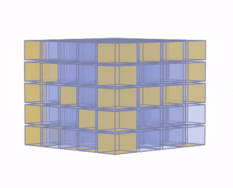

[`Análisis de Datos con Python`](../README.md) > `Sesión 3`

## Sesión 3: __NumPy__ para *Data Science*

### 1. Objetivos :dart: 

- Aprender sobre __NumPy__ y algunas funciones básicas para *Data Science*.

### 2. Contenido :blue_book:

El contenido de esta sesión lo puedes encontrar en [GitBook](https://beduexpert.gitbook.io/data-analysis/sesion-03-analisis-estadistico-de-datos-numpy).

#### <ins>Acerca de __NumPy__ y arreglos</ins>

   - [**`EJEMPLO 1`**](ejemplo01/README.md)
   - [**`RETO 1`**](reto01/README.md)

#### <ins>Arreglos, matrices y cubos</ins>

   - [**`EJEMPLO 2`**](ejemplo02/README.md)

#### <ins>Filtrado y limpieza de datos con __NumPy__</ins>

   - [**`EJEMPLO 3`**](ejemplo03/README.md)
   - [**`RETO 2`**](reto02/README.md)

#### <ins>Acceso a datos y funciones útiles de __NumPy__</ins>

   - [**`EJEMPLO 4`**](ejemplo04/README.md)
   - [**`RETO 3`**](reto03/README.md)

#### <ins>Operaciones punto a punto y funciones con __Numpy__</ins>

   - [**`EJEMPLO 5`**](ejemplo05/README.md)
   - [**`RETO 4`**](reto04/README.md)

### 3. Postwork :memo:
Aplica lo todo lo que aprendiste durante la sesión a tu proyecto personal.

- [**`POSTWORK SESIÓN 3`**](postwork/README.md)

 

[`Anterior`](../sesion02/README.md) | [`Siguiente`](../sesion04/README.md)
