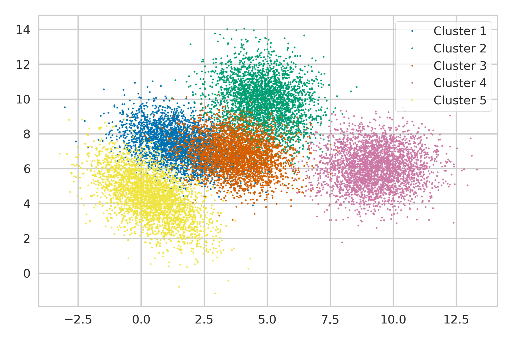

[`Análisis de Datos con Python`](../README.md) > `Sesión 6`

## Sesión 6: Visualización de datos con __MatPlotLib__

### 1. Objetivos :dart: 

- Aprender acerca de Gráficas de Dispersión
- Generar una gráfica de dispersión en 2D
- Aprender acerca de Subplanos
- Generar Gráficas de Dispersión 2D en subplanos
- Aprender acerca de Gráficas de Dispersión en 3D
- Generar Graficas de Dispersión 3D en Subplanos

### 2. Contenido :blue_book:

El contenido de esta sesión lo puedes encontrar en [GitBook](https://beduexpert.gitbook.io/data-analysis/sesion-06-visualizacion-de-datos-con-python-matplotlib-y-otras).

Todos los ejemplos se encuentran en: [**`EJEMPLOS`**](ejemplos/README.md)

#### <ins>Gráficas de Dispersión 2D</ins>

   - [**`RETO 1`**](reto01/README.md)

#### <ins>Subplanos 2D en Gráficas de Dispersión</ins>

   - [**`RETO 2`**](reto02/README.md)

#### <ins>Gráficas de Dispersión 3D</ins>

   - [**`RETO 3`**](reto03/README.md)

#### <ins>Subplanos de Dispersión 3D</ins>

   - [**`RETO 4`**](reto04/README.md)

### 3. Postwork :memo:
Aplica lo todo lo que aprendiste durante la sesión a tu proyecto personal.

- [**`POSTWORK SESIÓN 6`**](postwork/README.md)

 

[`Anterior`](../sesion04/README.md) | `Siguiente`
